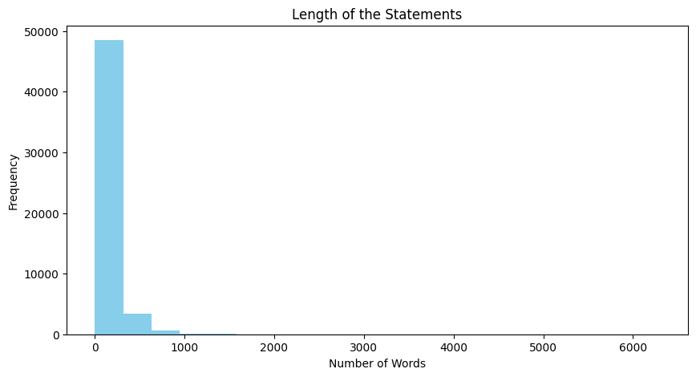

# Sentiment Analysis for Mental Health Status

## About this Dataset:
This comprehensive dataset is a meticulously curated collection of mental health statuses tagged from various statements. The dataset amalgamates raw data from multiple sources, cleaned and compiled to create a robust resource for developing chatbots and performing sentiment analysis.

## Data Source:
The dataset integrates information from the following Kaggle datasets:

- 3k Conversations Dataset for Chatbot
- Depression Reddit Cleaned
- Human Stress Prediction
- Predicting Anxiety in Mental Health Data
- Mental Health Dataset Bipolar
- Reddit Mental Health Data
- Students Anxiety and Depression Dataset
- Suicidal Mental Health Dataset
- Suicidal Tweet Detection Dataset

## Data Overview:
The dataset consists of statements tagged with one of the following seven mental health statuses:

- Normal
- Depression
- Suicidal
- Anxiety
- Stress
- Bi-Polar
- Personality Disorder

## Data Collection:
The data is sourced from diverse platforms including social media posts, Reddit posts, Twitter posts, and more. Each entry is tagged with a specific mental health status, making it an invaluable asset for:

Developing intelligent mental health chatbots.
Performing in-depth sentiment analysis.
Research and studies related to mental health trends.
Features:
unique_id: A unique identifier for each entry.
Statement: The textual data or post.
Mental Health Status: The tagged mental health status of the statement.
Usage:
**This dataset is ideal for training machine learning models aimed at understanding and predicting mental health conditions based on textual data**. It can be used in various applications such as:

1. Chatbot development for mental health support.
2. Sentiment analysis to gauge mental health trends.
3. Academic research on mental health patterns.

## Results

### Number of mental issues detected

The figure below shows a horizontal bar plot addressing the total amount of mental issues detected in the dataset, and also the *"Normal"* mental state. Besides the normal condition, it can be seen that **depression, suicidal, and anxiety** are the most common mental states detected.

### Length of the text reported

From the figure below it can be noticed that suicidal, personality disorder, and bipolar have more extreme outliers regarding length of the text. Noticeably, te normal mental health state seems to be the "most well behaved", since the length of the text reported seems to be well behaved.   

### Total number of sentences by status

Here, the number of sentences is studied by mental health conditions and the suicidal status seems to have the most weird behavior by having an outlier with more than 1200 sentences.

### Total number of unique words by Status

The following figure shows the total number of unique words by mental health status, from which one can notice that **bipolar, suicidal, and personality disorder** mental health statuses have the most extreme outliers in this dataset, and normal health status the least.

### Histogram of the length of statements

The following figure shows a histogram of the length of the statements from each patient showing that the greatest amount of length of statements lays between 0-1000, but there are cases where it reaches around 6000!! Therefore, a data treatment and simplication of the text must be implemented.

### Histogram of the length of statements truncated in 50

The following histogram is a simplification of the previous, where the sentences have been truncated up to just 50. This value of 50 was found empirically by testing with values ranging from 20 up to 300, and 50 was found to be present a good trade-off between performance and computing time.

### Confusion Matrix: Count Vectorizer model 1

In order to perform **Machine Learning modeling**, the data was split into training and testing datasets, and the MinMaxScaler was fitted and applied in the training set, as well this fitted scaler was applied in the testing set. For modeling, the simple yet robust **Logistic Regression** algorithm was used after the **Count Vectorizer** was applied. The results for the confusion matrix for all the classes (mental health entities) are displayed in the figure below.

### Classification Report: Count Vectorizer model 1

The figure below shows the classification report for all the classes for the algorithm applied in the previous part. By regarding precision, recall, and f1-score metrics, it is noticeable that the normal, anxiety, bipolar, and depression have a good performance, while the other classes are not being so well modeled. This can be explained by regarding the class imbalance presented in the dataset.

### Top 20 words responsible for the predictions in model 1

In the figure below one can see the top 20 words that have the largest contribution to the model's output.

### Top 20 words responsible for the predictions in model 1 for each mental health status

In the figure below one can see the top 20 words that have the largest contribution to the model's output grouped by each mental health status. For instance, for bipolar episodes the top words are: bipolar, manic, mania, maniac, depress, lithium; and for anxiety: restless, worri(ed), nervous, anxiety, anxiou, cancer. These words can help diagnosize mental health issues for a patient and take preventive actions in order to help them in mental health crisis/episodes. 

### Sentiment analysis by illness

Now, it is going to be performed a sentiment analysis in the statements for the patients. The sentiments can be grouped into positive, neutral, or negative, depending on the results of the algorithmic classification. The figure below shows this for the current dataset, from which one can notice that a normal health status tends to have less negative sentiments

The following figure shows each mental health status discriminated by the kind of sentiment

### Length of the sentence by Mental Health Status

The following figure shows the length of the statement whether the patient has a nmental issue or not, discriminated by the kind of sentiment. One can notice that "normal" patients. However, it is noteworthy that ill patients (class 1) that lie in the neutral sentiment category (orange color) also typically write much shorter sentences.

### Total number of sentences by sentiment category

In the following figure, one can see the total number of sentences by sentiment by category (negative, neutral, positive), from which it is evident that patients without any mental illness (class 0) typically write much shorter texts than patients that are experiencing a mental issue.

### Total number of words by sentiment category

In the following figure, it is shown the total number of words categorized by sentiment, from which one can notice that mental ill patients typically have also the largest number of words in a sentence, clearly being outliers. 

### Total number of unique words by sentiment category

In the next figure, it is shown the total number of unique words categorized by sentiment, from which one can notice the mental ill patients (class 1) that have either negative or positive sentiments tend to have a much larger number of unique words used in the sentences.

### Confusion Matrix: Count Vectorizer model 2

The following confusion matrix shows the modeling results for the second approach using a **Count Vectorizer Model**.

### Classification Report: Count Vectorizer model 2

Now, showing the results of the second modeling approach, but now displaying in the next figure the classification report, one can notice that normal patients are well diagnosed in this approach, as well as the following mental ilnesses: **Bipolar, Anxiety, and Depression**.

## Acknowledgments:

This dataset was created by aggregating and cleaning data from various publicly available datasets on Kaggle. Special thanks to the original dataset creators for their contributions.

## MIT License

### Copyright (c) [2025] [Vagner Zeizer Carvalho Paes]

Permission is hereby granted, free of charge, to any person obtaining a copy
of this software and associated documentation files (the "Software"), to deal
in the Software without restriction, including without limitation the rights
to use, copy, modify, merge, publish, distribute, sublicense, and/or sell
copies of the Software, and to permit persons to whom the Software is
furnished to do so, subject to the following conditions:

The above copyright notice and this permission notice shall be included in all
copies or substantial portions of the Software.

THE SOFTWARE IS PROVIDED "AS IS", WITHOUT WARRANTY OF ANY KIND, EXPRESS OR
IMPLIED, INCLUDING BUT NOT LIMITED TO THE WARRANTIES OF MERCHANTABILITY,
FITNESS FOR A PARTICULAR PURPOSE AND NONINFRINGEMENT. IN NO EVENT SHALL THE
AUTHORS OR COPYRIGHT HOLDERS BE LIABLE FOR ANY CLAIM, DAMAGES OR OTHER
LIABILITY, WHETHER IN AN ACTION OF CONTRACT, TORT OR OTHERWISE, ARISING FROM,
OUT OF OR IN CONNECTION WITH THE SOFTWARE OR THE USE OR OTHER DEALINGS IN THE
SOFTWARE.

